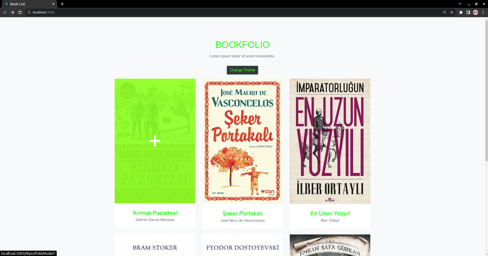
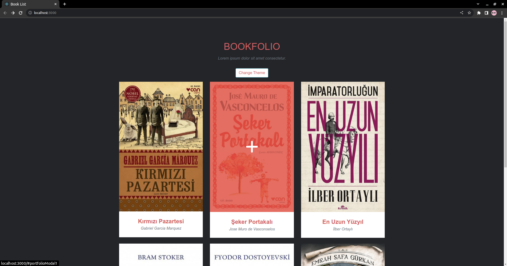

# React Proje 2) Kitap Sitesi
İkinci react projem de kitapların listelendiği ve buton ile sitenin temasının değiştirildiği bir proje gerçekleştirdim.

### Uygun Scriptler

Proje klasörünün içerisinde aşağıdaki komut ile uygulamayı çalıştırabilirsiniz: 

### `npm start`

## License
[MIT](https://choosealicense.com/licenses/mit/)