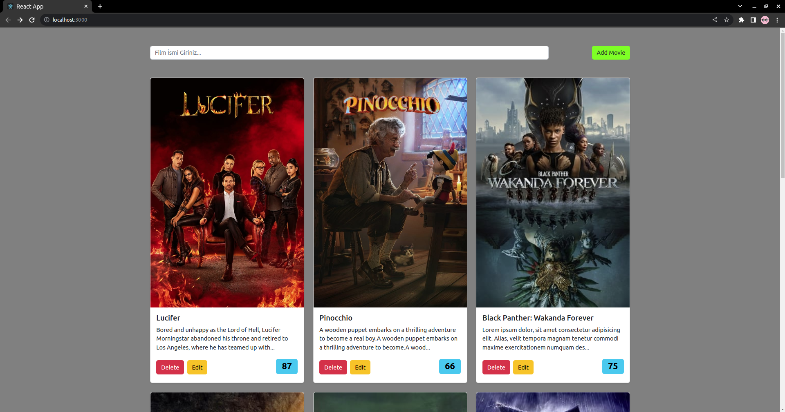
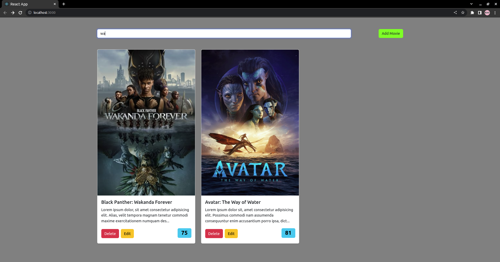
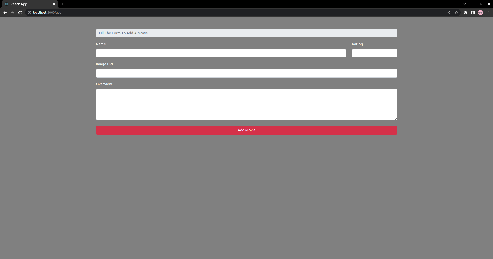
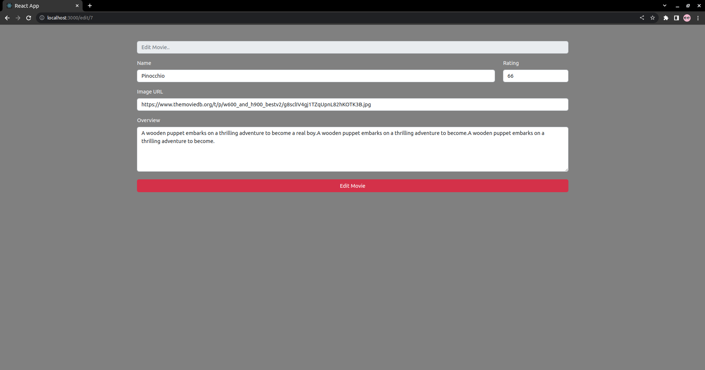

# React Proje 3) Film Sitesi

Bu projede filmlerin listelendiği bir site tasarlandı. Ara kısmından filmler filtrelenebilmektedir. Ayrıca yeni filmlerin eklenebilmesi için add movie butonu eklendi. Her film kartının üstünde film bilgilerinin düzenlenebileceği edit butonu ve filmin listeden silinebilmesi için delete butonu eklenmiştir. Film bilgileri JSON server ile movies.json dosyasından alınmaktadır. Ayrıca eklenen veya silinen filmler direk json dosyasına da güncellenmektedir.    

### Uygun Scriptler

Json serverı çalıştırmak için aşağıdaki komutu girin ardından projeyi çalıştırın: 

#### `npx json-server --watch src/api/movies.json --port 3002`

Proje klasörünün içerisinde aşağıdaki komut ile uygulamayı çalıştırabilirsiniz: 

#### `npm start`

## License
[MIT](https://choosealicense.com/licenses/mit/)